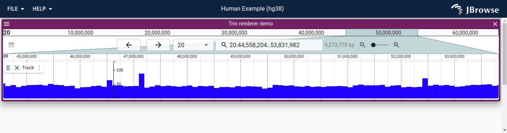

# VCF raw parsing demo for JBrowse 2

This demo uses raw @gmod/tabix for pure parsing speed

## Install

    yarn

## Usage

    yarn develop --port 9001

## Screenshot

## Demo

While `yarn develop` is running, open jbrowse-components dev server
in another tab e.g. cd packages/jbrowse-web, yarn start, and then visit

http://localhost:3000/?config=http://localhost:9000/config.json

## Use in production

Run `yarn build`, and then add the resulting plugin.js to the runtime plugins
section of the config. This is the same plugin.js type reference in the
assets/config.json folder
